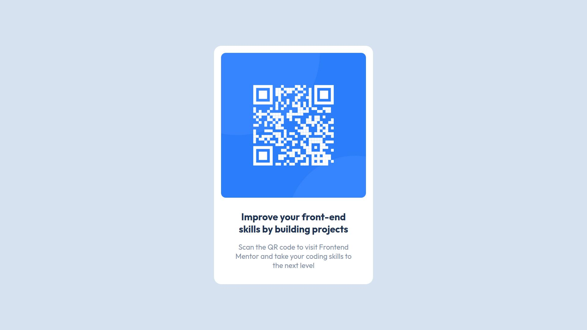

# Frontend Mentor - QR code component solution

This is a solution to the [QR code component challenge on Frontend Mentor](https://www.frontendmentor.io/challenges/qr-code-component-iux_sIO_H). Frontend Mentor challenges help you improve your coding skills by building realistic projects.

## Table of contents

- [Overview](#overview)
  - [Screenshot](#screenshot)
  - [Links](#links)
- [My process](#my-process)
  - [Built with](#built-with)
  - [What I learned](#what-i-learned)
  - [Continued development](#continued-development)
  - [Useful resources](#useful-resources)
- [Author](#author)
- [Acknowledgments](#acknowledgments)

## Overview

### Screenshot



### Links

- Solution URL: https://www.frontendmentor.io/solutions/qr-code-component-using-basic-html-css-and-flexbox-E7aSMMQjk
- Live Site URL: https://ronylee11.github.io/qr-code-component/

## My process

### Built with

- Semantic HTML5 markup
- CSS custom properties
- Flexbox
- [Google Fonts](https://fonts.google.com/) - For font styles

### What I learned

I've refreshed my knowledge of html and css, tinkered around with paddings, widths, border-radius, etc. I've got pretty comfortable using them.

I've used Flexbox in this project, which ultimately provides a clean look by centering it

```html
<section class="card">
  
  <p>Improve your front-end skills by building projects</p>
  <p>
    Scan the QR code to visit Frontend Mentor and take your coding skills to the
    next level
  </p>
</section>
```

```css
.card {
  background-color: hsl(0, 0%, 100%);
  border: hsl(0, 0%, 100%) solid 15px;
  border-radius: 15px;
  width: 300px;
  height: auto;
  display: flex;
  flex-direction: column;
  align-items: center;
}
```

### Continued development

I've found myself insufficient to give responsive units of widths and heights. I've used vh, %, and auto as the "responsive units", or so i thought, but i never really get the hang of it and just using them randomly. I need to learn more about this area.

### Useful resources

- [Flexbox in MDN](https://developer.mozilla.org/en-US/docs/Learn/CSS/CSS_layout/Flexbox) - This has helped me to refresh my knowledge about Flexbox and knowing what options are there when it comes to using Flexbox.
- [QR Code Component Challenge by Frontend Mentor](https://www.frontendmentor.io/challenges/qr-code-component-iux_sIO_H) - This is an amazing hands-on starter project on Frontend Mentor, which is why I've started this project in the first place. It helped me finally understand Flexbox layout. I'd recommend it to anyone still learning web development.

## Author

- Github - [@ronylee11](https://github.com/ronylee11)
- Frontend Mentor - [@ronylee11](https://www.frontendmentor.io/profile/ronylee11)
- Twitter - [@rongyil33](https://twitter.com/rongyil33)
- Instagram - [@rongyil33](https://www.instagram.com/rongyil33/)

## Acknowledgments

All the images, design and materials are given by Frontend Mentor. Check them out on https://www.frontendmentor.io
